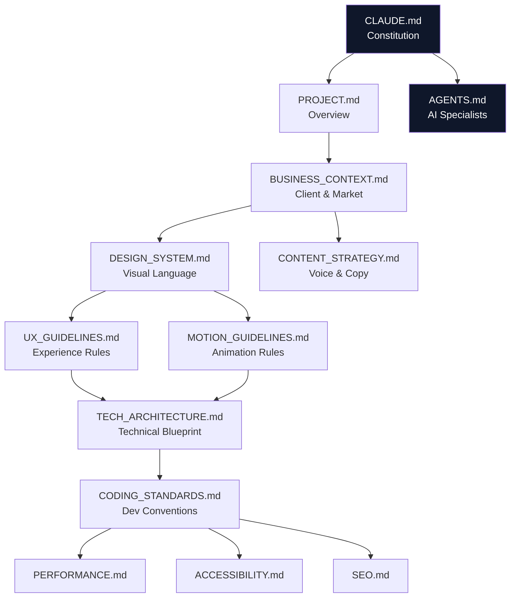
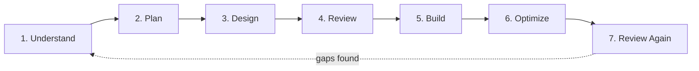

# CLAUDE.md — Project Constitution

**SK Internationals Website — Premium B2B Logistics Digital Experience**

This is the highest-authority document in this repository. Every other document in the documentation system inherits its principles from this file. If any other document appears to conflict with this one, this file wins.

---

## Table of Contents

1. [Mission](#mission)
2. [Documentation System](#documentation-system)
3. [Working Philosophy](#working-philosophy)
4. [Quality Standards](#quality-standards)
5. [Coding Philosophy](#coding-philosophy)
6. [Workflow](#workflow)
7. [Engineering Principles](#engineering-principles)
8. [Definition of Done](#definition-of-done)
9. [AI Instructions](#ai-instructions)
10. [Non-Negotiable Rules](#non-negotiable-rules)
11. [Anti-Patterns](#anti-patterns)
12. [Related Documentation](#related-documentation)

---

## Mission

Build a premium B2B corporate website for SK Internationals.

This is **not** a template website. It is a digital brand experience engineered to:

- Establish trust within seconds of arrival
- Strengthen SK Internationals' brand identity in the logistics sector
- Generate qualified business leads

Within the first 10 seconds, every visitor must understand:

| Question | Must be answered by |
|---|---|
| Who is this company? | Hero section, brand voice |
| What do they do? | Hero subheading, services overview |
| Why should I trust them? | Social proof, credentials, visual polish |
| How do I contact them? | Persistent, obvious CTA |

Every design and engineering decision must improve the perception of the company. Never sacrifice quality for speed. See [BUSINESS_CONTEXT.md](claude/BUSINESS_CONTEXT.md) for the full commercial rationale behind this mission.

---

## Documentation System

This project is governed by 13 documents. Each has exactly one responsibility. Do not duplicate content across files — reference instead.

| # | File | Purpose |
|---|---|---|
| 1 | [CLAUDE.md](CLAUDE.md) | Project constitution — mission, philosophy, non-negotiable rules |
| 2 | [PROJECT.md](claude/PROJECT.md) | High-level overview — goals, scope, timeline, deliverables |
| 3 | [BUSINESS_CONTEXT.md](claude/BUSINESS_CONTEXT.md) | Everything about the client, market, and buyer |
| 4 | [DESIGN_SYSTEM.md](claude/DESIGN_SYSTEM.md) | Visual language — color, type, spacing, components |
| 5 | [UX_GUIDELINES.md](claude/UX_GUIDELINES.md) | Navigation, information architecture, conversion, accessib ­ility of flow |
| 6 | [MOTION_GUIDELINES.md](claude/MOTION_GUIDELINES.md) | Animation philosophy and implementation rules |
| 7 | [CODING_STANDARDS.md](claude/CODING_STANDARDS.md) | Folder structure, naming, TypeScript, review checklist |
| 8 | [TECH_ARCHITECTURE.md](claude/TECH_ARCHITECTURE.md) | Rendering strategy, state, dependencies, deployment |
| 9 | [CONTENT_STRATEGY.md](claude/CONTENT_STRATEGY.md) | Brand voice, tone, copywriting rules |
| 10 | [SEO.md](claude/SEO.md) | Metadata, structured data, technical SEO |
| 11 | [PERFORMANCE.md](claude/PERFORMANCE.md) | Budgets, optimization, Lighthouse targets |
| 12 | [ACCESSIBILITY.md](claude/ACCESSIBILITY.md) | WCAG compliance, keyboard, ARIA, screen readers |
| 13 | [AGENTS.md](AGENTS.md) | Definitions of the AI specialist roles used on this project |

**Rule of thumb:** if you're about to write something that already lives in another file, delete it and link there instead.

**Documentation freeze:** as of the completion of [BUSINESS_CONTEXT.md](claude/BUSINESS_CONTEXT.md)'s and [UX_GUIDELINES.md](claude/UX_GUIDELINES.md)'s reconciliation against verified client data, the `claude/` documentation set is frozen. From this point forward, these files change only when the client provides new business information — not for internal design iteration. Design/engineering deliverables that build on this foundation (homepage architecture, hero concepts, engineering blueprints) are tracked separately and do not reopen the freeze.

---

## Working Philosophy

Before writing code, think. Before designing, understand the business. Before adding animation, ask whether it improves communication.

- Every decision must have a reason — "it looks nice" is not a reason, "it reduces cognitive load at the decision point" is.
- Do not generate generic sections. If a section could belong to any logistics company's website, rewrite it.
- Do not generate placeholder-heavy layouts. Real copy, real hierarchy, real content decisions — even in draft.
- Avoid anything that looks AI-generated or template-based: stock-photo energy, generic three-column "feature grids" with icon-headline-paragraph repeated four times, interchangeable testimonial carousels.

---

## Quality Standards

This project is judged against premium digital agency output, not against "does it work."

| Standard | Bar |
|---|---|
| Visual polish | Every screen looks intentionally art-directed, not assembled from defaults |
| Responsiveness | Flawless from 320px to ultra-wide, not just "doesn't break" |
| Performance | Lighthouse ≥ 95 across the board — see [PERFORMANCE.md](claude/PERFORMANCE.md) |
| Accessibility | WCAG AA minimum — see [ACCESSIBILITY.md](claude/ACCESSIBILITY.md) |
| Consistency | Every component traces back to [DESIGN_SYSTEM.md](claude/DESIGN_SYSTEM.md) tokens |
| Content | Every sentence earns its place — see [CONTENT_STRATEGY.md](claude/CONTENT_STRATEGY.md) |

---

## Coding Philosophy

- Use TypeScript strictly — no `any` as an escape hatch.
- Prefer reusable components over one-off implementations, but never abstract before the third repetition.
- Never duplicate logic. Extract shared logic into hooks or utilities once it appears twice with intent to appear a third time.
- Keep components focused on a single responsibility.
- Write readable code over clever code. A reviewer should understand intent without running the code.
- Organize folders consistently — see [CODING_STANDARDS.md](claude/CODING_STANDARDS.md) for the canonical structure.
- Avoid unnecessary dependencies. Every dependency in [TECH_ARCHITECTURE.md](claude/TECH_ARCHITECTURE.md) must be justified.

---

## Workflow

Work happens in phases. Do not skip planning. Do not jump directly into implementation.

| Phase | Question to answer before moving on |
|---|---|
| 1. Understand | What business problem does this section/feature solve? |
| 2. Plan | What is the simplest structure that solves it well? |
| 3. Design | Does this follow [DESIGN_SYSTEM.md](claude/DESIGN_SYSTEM.md) and [UX_GUIDELINES.md](claude/UX_GUIDELINES.md)? |
| 4. Review | Would a Principal Engineer and a Creative Director both approve this plan? |
| 5. Build | Implement per [CODING_STANDARDS.md](claude/CODING_STANDARDS.md) and [TECH_ARCHITECTURE.md](claude/TECH_ARCHITECTURE.md) |
| 6. Optimize | Does it meet [PERFORMANCE.md](claude/PERFORMANCE.md) budgets? |
| 7. Review Again | Run the [Definition of Done](#definition-of-done) checklist |

---

## Engineering Principles

1. **Correctness before cleverness.** A boring solution that works beats an elegant one that's fragile.
2. **Composability.** Components should compose without special-casing.
3. **Predictability.** Given the same props/state, a component always renders the same output.
4. **Locality of behavior.** Logic that affects a component should live near that component unless shared.
5. **Progressive enhancement.** Core content and CTAs must work before JavaScript hydrates.
6. **Fail loud in development, fail gracefully in production.**

---

## Definition of Done

A task is complete only when **all** boxes are checked — never stop at "it works."

- [ ] Clean architecture — follows [TECH_ARCHITECTURE.md](claude/TECH_ARCHITECTURE.md)
- [ ] Responsive across all breakpoints
- [ ] Accessible — passes [ACCESSIBILITY.md](claude/ACCESSIBILITY.md) checklist
- [ ] Performant — meets [PERFORMANCE.md](claude/PERFORMANCE.md) budgets
- [ ] SEO friendly — follows [SEO.md](claude/SEO.md)
- [ ] Production ready — no console errors, no TODOs left silently
- [ ] Visually polished — matches [DESIGN_SYSTEM.md](claude/DESIGN_SYSTEM.md)
- [ ] Consistent with the rest of the system — no one-off patterns

---

## AI Instructions

These instructions apply to any AI agent (Claude Code or otherwise) working in this repository.

1. **Read before you write.** Before touching a domain (design, motion, copy, SEO), read the corresponding file in `claude/`. Do not infer conventions from a single existing component when a written standard exists.
2. **Route by specialty.** Use the specialist roles defined in [AGENTS.md](AGENTS.md) to decide what lens to apply — a copy change should be evaluated against [CONTENT_STRATEGY.md](claude/CONTENT_STRATEGY.md), not invented fresh.
3. **Never duplicate documentation.** If you learn something that belongs in `DESIGN_SYSTEM.md`, write it there — not as a comment in a component, not as a new file.
4. **Ask when the business reason is unclear.** If a request would violate [Non-Negotiable Rules](#non-negotiable-rules) or lacks a clear business justification, surface the conflict instead of guessing.
5. **Prefer editing over rewriting.** Extend existing components and patterns before introducing new ones.
6. **Justify every dependency.** Do not install a package without checking it against [TECH_ARCHITECTURE.md](claude/TECH_ARCHITECTURE.md) dependency justification rules.
7. **Run the Definition of Done checklist before declaring work complete.**

---

## Non-Negotiable Rules

These rules cannot be overridden by convenience, deadline pressure, or a single stakeholder request without updating this document first.

- Never sacrifice quality for speed.
- Never ship a section that could belong to any generic logistics template.
- Never introduce an animation that does not improve understanding (see [MOTION_GUIDELINES.md](claude/MOTION_GUIDELINES.md)).
- Never use `any` in TypeScript without an explicit, commented reason.
- Never ship inaccessible interactive elements.
- Never regress Lighthouse performance scores below 95 without sign-off.
- Never hardcode design values that already exist as tokens in [DESIGN_SYSTEM.md](claude/DESIGN_SYSTEM.md).
- Never duplicate content across documentation files.

---

## Anti-Patterns

| Anti-pattern | Why it's rejected | Do this instead |
|---|---|---|
| Three-column "icon + headline + paragraph" feature grid, repeated verbatim | Reads as templated, adds no information hierarchy | Vary layout rhythm per section; let content dictate structure |
| Animating everything on scroll "because it's more dynamic" | Motion without purpose degrades trust and performance | Animate only where it clarifies sequence or hierarchy — see [MOTION_GUIDELINES.md](claude/MOTION_GUIDELINES.md) |
| Copying a component and tweaking two props | Creates drift and duplicate logic | Parameterize the existing component |
| Writing marketing copy inline in JSX without checking tone | Produces inconsistent brand voice | Check [CONTENT_STRATEGY.md](claude/CONTENT_STRATEGY.md) first |
| Adding a new npm package for a one-line utility | Bloats the bundle, adds supply-chain surface | Write the utility; justify any real dependency in [TECH_ARCHITECTURE.md](claude/TECH_ARCHITECTURE.md) |
| Stopping at "it renders" | Doesn't meet the quality bar of this project | Run the full [Definition of Done](#definition-of-done) |

---

## Related Documentation

- [PROJECT.md](claude/PROJECT.md) — what we're building and why, at a glance
- [BUSINESS_CONTEXT.md](claude/BUSINESS_CONTEXT.md) — the client and their market
- [AGENTS.md](AGENTS.md) — the AI specialist roles that apply this constitution
- All other files listed in [Documentation System](#documentation-system) above
