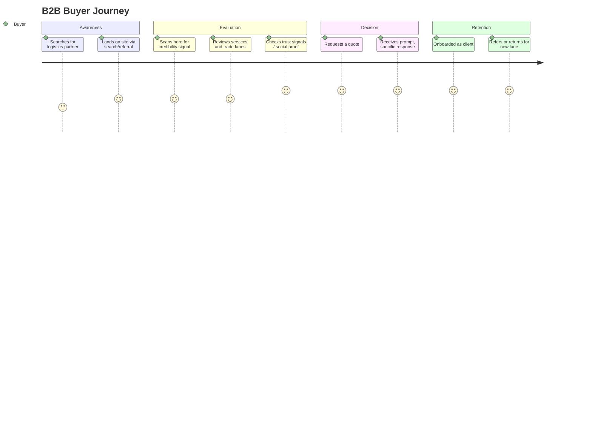

# BUSINESS_CONTEXT.md — Client & Market Context

Everything about SK Internationals as a business — who they are, who they sell to, and why this website needs to exist. [PROJECT.md](PROJECT.md) summarizes the parts relevant to scope; this file is the full detail behind it.

> **Verification status:** Company Overview, Services, and Target Trade Lanes are now **verified** against a real company brochure and direct client confirmation — no longer draft. **Certifications and testimonials do not exist yet** and remain pending; the final logo file is also pending. Do not fabricate placeholder content for either — see [Strategic Positioning Decisions](#strategic-positioning-decisions).

---

## Table of Contents

1. [Company Overview](#company-overview)
2. [Services](#services)
3. [Target Trade Lanes](#target-trade-lanes)
4. [Target Audience](#target-audience)
5. [Pain Points](#pain-points)
6. [Customer Journey](#customer-journey)
7. [Business Goals](#business-goals)
8. [Value Proposition](#value-proposition)
9. [Brand Positioning](#brand-positioning)
10. [Lead Generation Strategy](#lead-generation-strategy)
11. [Strategic Positioning Decisions](#strategic-positioning-decisions)
12. [Related Documentation](#related-documentation)

---

## Company Overview

| Field | Value |
|---|---|
| Legal/trading name | SK Internationals |
| Industry | Freight forwarding, multimodal logistics, NVOCC operations |
| Founded | 2011 |
| Registered office | SMS Complex, No. 10, 1st Floor, Rani Garden, Opposite Jayendra Saraswathy College, Singanallur, Coimbatore - 641033 |
| Base of operations | Chennai and Tuticorin, India — both major maritime centers, strategically chosen for port operations |
| Customer type | B2B exclusively |
| Operating model | Acts as both freight forwarder and NVOCC; core capabilities managed in-house rather than subcontracted |

The company's own stated vision is to become "one among the top shipping, forwarding and logistics companies in the world." That is an internal ambition, not public-facing copy — a young, two-contact company claiming top-of-world status without proof reads as inflated to a sophisticated B2B buyer. Public copy on the site must use the provable, specific claims below (tenure, lanes, service breadth) instead — see [CONTENT_STRATEGY.md](CONTENT_STRATEGY.md) and [Strategic Positioning Decisions](#strategic-positioning-decisions).

---

## Services

Confirmed service lines:

| Service | Description |
|---|---|
| Sea Freight | FCL, LCL, break-bulk, and ro/ro; operates as both forwarder and NVOCC; terminal-to-terminal or full door-to-door; includes vendor consolidation, multimodal transportation, warehousing/distribution programs, and purchase-order management |
| Air Freight | Airport-to-airport and door-to-door, inbound and outbound; focused on heavyweight, time-definite global movement |
| Surface Transport & Project Cargo | LTL/groupage surface services, over-dimensional cargo (ODC), and project cargo — managed fully in-house end-to-end for complete control and accountability |
| Warehousing & Distribution | Nationwide across India, including cross-dock and just-in-time distribution programs |

Supporting activities (positioned as depth signals, not separate headline services): linear agency, port/offshore vessel support services, global LCL consolidation, sea/air chartering, customs clearance/brokerage, and trade consulting.

Each confirmed service line gets a dedicated card on the homepage — see [UX_GUIDELINES.md](UX_GUIDELINES.md#information-architecture).

---

## Target Trade Lanes

Confirmed regional focus: **Persian & Arabian Gulf, the Red Sea, and the Indian Sub-Continent**, operated out of Chennai and Tuticorin.

This is a real differentiator, not a limitation — see [Top 5 Opportunities](#strategic-positioning-decisions). Most competitor sites claim to "ship anywhere"; SK Internationals can credibly own a specific geography instead. Trade-lane specificity should be visible on the homepage as its own dedicated moment, not buried in body copy — see the Trade Lane Focus section in the homepage architecture.

---

## Target Audience

Two confirmed segments — the site must serve both without diluting either:

| Persona | Role | What they're evaluating |
|---|---|---|
| Procurement Manager | Owns vendor selection and cost | Total landed cost, contract reliability |
| Supply Chain / Operations Director | Owns end-to-end delivery performance | Transit reliability, visibility, escalation handling |
| SME Importer/Exporter Owner | Wears every hat | Simplicity, responsiveness, trust without a large internal logistics team |
| Enterprise Logistics Coordinator | Manages day-to-day shipment execution | Communication quality, documentation accuracy |
| **Overseas Partner / Agent** (confirmed second segment) | Another freight forwarder or agent routing business through SK Internationals | Reliability as a subcontracted operator, clear partnership terms, not a shipper-oriented sales pitch |

The Overseas Partner/Agent segment is not secondary — the client's own materials explicitly frame serving "overseas partners and agents" as a core focus. This is why the site uses a two-path CTA ("Request a Quote" for shippers, "Partner With Us" for agents) rather than a single undifferentiated funnel — see [UX_GUIDELINES.md](UX_GUIDELINES.md#cta-rules).

Every persona is evaluating a **partner**, not a transaction — the site must read as evidence of operational maturity, not just list services.

---

## Pain Points

What makes B2B buyers distrust or churn from logistics vendors — the site's job is to visibly counter each one.

| Pain Point | Site's Counter |
|---|---|
| Unreliable transit times | Process transparency section, tenure as a track-record signal |
| Lack of shipment visibility | SK Internationals' existing internet-accessible visibility system, explained in the process section |
| Opaque, surprise pricing | Clear "Request a Quote" flow, no bait-and-switch language |
| Fragmented points of contact | Named account ownership — "a real person owns your shipment" |
| Customs delays and compliance risk | Explicit customs/compliance service messaging |
| Vendor feels like a call center, not a partner | Brand voice — see [CONTENT_STRATEGY.md](CONTENT_STRATEGY.md) |

---

## Customer Journey

The website's scope covers **Awareness → Decision**. Retention is operational, outside this project's scope — see [PROJECT.md](PROJECT.md#project-scope).

---

## Business Goals

1. Generate qualified, sales-ready leads — not just traffic.
2. Elevate brand perception to compete for enterprise contracts, not just price-sensitive SMEs.
3. Reduce dependency on referral-only lead generation by building organic and direct-search presence (see [SEO.md](SEO.md)) around the confirmed trade lanes.
4. Create a reusable brand asset that supports future trade-lane or service-line expansion without a redesign.
5. Serve both direct-shipper and overseas-partner/agent audiences from one site without diluting either funnel.

---

## Value Proposition

The five value statements below are the client's own stated commitments, adopted as the site's real proof points — specific and behavioral rather than superlative, so they survive scrutiny from a sophisticated B2B buyer:

| Pillar | On-site framing |
|---|---|
| Do it right the first time, every time | Reliability as a default, not an exception |
| Reliable, fast & on-time service | Tenure-backed track record (est. 2011) |
| Accurate, complete, timely information | Process transparency, visibility system |
| Responsive, ready to meet customer need | Named account ownership, response-time commitment |
| Efficient, improved service at lower cost | Integrated multimodal service under one operator |

| Pillar | Proof point on site |
|---|---|
| Reliability | Tenure since 2011, process transparency |
| Transparency | Clear quote flow, visibility system explanation |
| Personal partnership | Named account ownership, human-forward copy |
| Global reach, local execution | Confirmed trade-lane specificity (Gulf, Red Sea, Indian Sub-Continent) |

---

## Brand Positioning

| | Commoditized Freight Broker | SK Internationals (target position) | Large Impersonal 3PL |
|---|---|---|---|
| Price | Lowest | Fair, value-justified | Volume-discounted |
| Personal service | Low | High | Low |
| Perceived reliability | Variable | High | High |
| Digital brand experience | Generic/dated | Premium, modern | Corporate, generic |

SK Internationals should occupy the space a large enterprise 3PL occupies on reliability, but with the personal account ownership a broker cannot offer — communicated through the premium digital experience defined in [DESIGN_SYSTEM.md](DESIGN_SYSTEM.md). The existing logo and brand colors are retained as the fixed brand identity; the digital design system may evolve independently of the brochure's literal visual style while preserving recognition — see [Strategic Positioning Decisions](#strategic-positioning-decisions).

---

## Lead Generation Strategy

| Layer | Mechanism |
|---|---|
| Primary CTA | "Request a Quote" for direct shippers — present persistently, never buried |
| Secondary path | "Partner With Us" for overseas agents/partners — a segment toggle at the point of conversion, not a duplicated page |
| Trust layer | Tenure since 2011, process transparency, confirmed trade-lane depth |
| Organic layer | SEO-optimized service and trade-lane content — see [SEO.md](SEO.md) |
| Conversion UX | Low-friction quote form — see [UX_GUIDELINES.md](UX_GUIDELINES.md#cta-rules) |

### Anti-patterns

| Anti-pattern | Why it fails a B2B logistics buyer |
|---|---|
| "Contact Us" as the only CTA | Too passive for a buyer ready to act |
| Long, generic lead form upfront | High-intent B2B buyers abandon over-qualification forms |
| Stock photography of shipping containers, or the brochure's literal plane/ship/truck renders | Reads as generic — undermines premium positioning |
| Vague "we ship anywhere" claims | Signals lack of real trade-lane depth to an informed buyer |
| One undifferentiated form for shippers and agents | Serves neither audience well |

---

## Strategic Positioning Decisions

Outcomes of the pre-design strategic analysis, recorded here as durable facts so they don't need to be re-derived later.

- **Track record over badges.** No certifications exist yet. Trust is built on tenure (est. 2011), process transparency, and specific verifiable claims — not fabricated or placeholder trust badges. When real certifications or testimonials are provided, they get added; nothing is faked in the meantime.
- **Personal contact exposure — resolved.** The brochure lists several named individuals' personal mobile numbers; most are not published. The client has designated one general contact channel (saravanakumaar@skinternationals.in, +91 88700 15754) for public display in the site's Contact section and footer — the quote form remains the primary conversion path, with this channel as the direct-contact alternative.
- **Brochure imagery is a data source, not a design constraint.** Photoreal plane/ship/truck renders and literal world-map iconography from the brochure are not carried into the site's visual language — see [DESIGN_SYSTEM.md](DESIGN_SYSTEM.md) anti-patterns.
- **Logo stays, palette can evolve.** The existing SK Internationals logo is the fixed brand identity and is not being redesigned. The site's color palette (navy/orange/slate per [DESIGN_SYSTEM.md](DESIGN_SYSTEM.md)) may evolve independently of the brochure's literal orange/navy/green combination while preserving brand recognition.
- **Two-audience segmentation.** Direct shippers and overseas partners/agents are both real, confirmed audiences. Resolved via a segment toggle inside the quote form rather than a duplicated page/IA — see [UX_GUIDELINES.md](UX_GUIDELINES.md#cta-rules).
- **Testimonials slot is reserved, not faked.** The homepage architecture holds a structural slot for social proof that ships with tenure/commitment content at launch and swaps to real client testimonials once shared — never filled with placeholder or stock quotes.

---

## Related Documentation

- [PROJECT.md](PROJECT.md) — how this context translates into scope and deliverables
- [CONTENT_STRATEGY.md](CONTENT_STRATEGY.md) — how this positioning becomes copy
- [UX_GUIDELINES.md](UX_GUIDELINES.md) — how the customer journey and segmentation become site structure
- [SEO.md](SEO.md) — how target audience and services become keyword strategy
