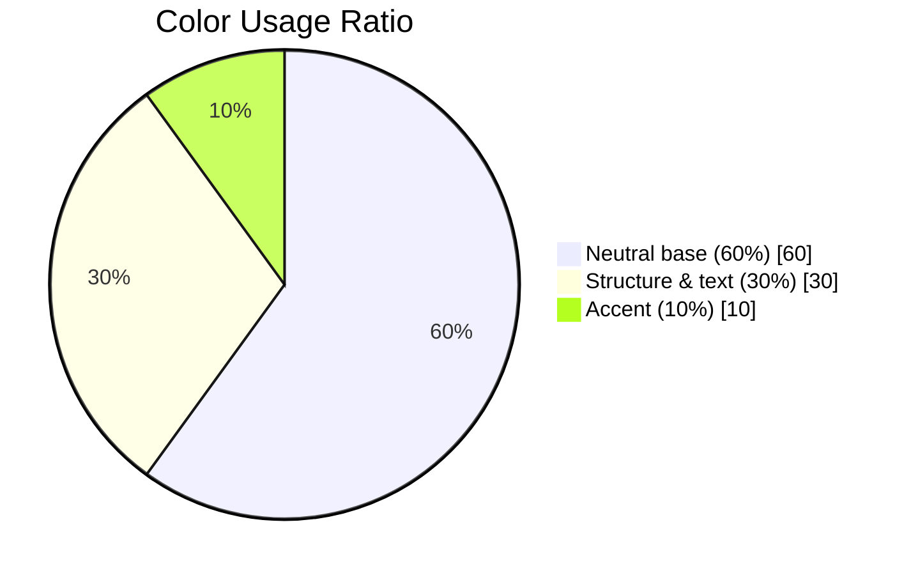

# DESIGN_SYSTEM.md — Visual Language

The single source of truth for every visual decision on this site. If a component's color, spacing, or radius isn't defined here, it doesn't ship — extend this document first, then the component.

Implementation lives in `app/globals.css` via Tailwind v4's `@theme` directive. This document is the spec that file must match.

---

## Table of Contents

1. [Design Principles](#design-principles)
2. [Color Palette](#color-palette)
3. [Typography](#typography)
4. [Spacing System](#spacing-system)
5. [Grid](#grid)
6. [Buttons](#buttons)
7. [Cards](#cards)
8. [Forms](#forms)
9. [Inputs](#inputs)
10. [Icons](#icons)
11. [Elevation](#elevation)
12. [Radius](#radius)
13. [Component Tokens](#component-tokens)
14. [Visual Examples](#visual-examples)
15. [Related Documentation](#related-documentation)

---

## Design Principles

1. **Whitespace is a feature, not empty space.** When in doubt, add more.
2. **Typography leads the design.** Hierarchy should be legible with color and imagery removed.
3. **Content is concise.** Every section answers exactly one business question — see [CLAUDE.md](../CLAUDE.md#mission).
4. **Every CTA has purpose.** No decorative buttons.
5. **Consistency over novelty.** A new pattern is only justified if the token system can't already express it.

Motion is governed separately — see [MOTION_GUIDELINES.md](MOTION_GUIDELINES.md).

---

## Color Palette

| Token | Hex | Role |
|---|---|---|
| `primary` | `#EA580C` | Buttons, icons, links, active states — the one accent color. Never a large fill. |
| `primary-hover` | `#C2410C` | Hover/pressed state for `primary` elements |
| `secondary` | `#0B2545` | Dark UI surfaces — reserved for the Hero, CTA bands, and the Footer only |
| `accent` | `#EA580C` | Alias of `primary`, kept for existing call sites |
| `background` | `#FAFAFA` | Page and section backgrounds |
| `surface` | `#FFFFFF` | Cards, forms, elevated panels |
| `surface-alt` | `#F5F2EC` | Alternating warm section backgrounds (services, stats, contact form panel) |
| `text` | `#0B2545` | Headlines and body copy |
| `text-secondary` (`muted`) | `#3D5878` | Supporting copy, captions, metadata |
| `border` | `#DDE3EC` | Dividers, input borders |
| `scrim` | `#18181B` | Neutral gradient over hero footage/photography only — the pre-navy tint, kept so video reads true to colour. Never text, never a UI surface. |
| `success` | `#16A34A` | Form success states |
| `error` | `#DC2626` | Form validation errors |

**2026-07-19 rebrand:** orange (`primary`/`accent`) is deliberately restricted to small interactive surfaces (buttons, icons, links, active-tab states) — never section backgrounds or headline text. Headlines/body text on light backgrounds use `text`. Large dark surfaces use `secondary` and are limited to the Stats band, CTA bands, and the Footer; everything else stays white/`background`/`surface-alt`.

**2026-07-21 client revision — no black:** the palette is now **orange, white, and deep navy only**. Every near-black value was replaced by navy `#0B2545`: `secondary` (dark panels), `text`, `navbar-text`, and the header shadow; `text-secondary` moved to the navy-tinted `#3D5878` and `border` to `#DDE3EC`. Pure black (`#000`, `text-black`, `rgba(0,0,0,…)`) must not appear anywhere in the codebase — including shadows and overlays.

### Usage rule: 60 / 30 / 10

| Share | Role | Tokens |
|---|---|---|
| 60% | Neutral base | `background`, `surface` |
| 30% | Structure & text | `secondary` (dark bands only), `text`, `text-secondary` |
| 10% | Emphasis | `primary` / `accent` |



**Rule:** if `accent` appears more than once per viewport, it has stopped being an accent. Reserve it for the single most important action in view.

---

## Typography

| Role | Family |
|---|---|
| Headings | Manrope |
| Body | Inter |

### Type Scale

| Token | Size | Weight | Line Height | Use |
|---|---|---|---|---|
| `display` | 56–72px (clamp) | 700 | 1.05 | Hero headline only |
| `h1` | 40–48px | 700 | 1.1 | Section titles |
| `h2` | 32px | 600 | 1.2 | Sub-section titles |
| `h3` | 24px | 600 | 1.3 | Card/group titles |
| `body-lg` | 18px | 400 | 1.6 | Lead paragraphs |
| `body` | 16px | 400 | 1.6 | Default copy |
| `caption` | 14px | 500 | 1.4 | Labels, metadata |

Never skip a heading level for visual effect (e.g., using `h3` styling on an `h2` element) — see [ACCESSIBILITY.md](ACCESSIBILITY.md#semantic-html).

---

## Spacing System

8px base unit. All spacing must come from this scale — no arbitrary pixel values.

| Token | Value |
|---|---|
| `space-1` | 4px |
| `space-2` | 8px |
| `space-3` | 12px |
| `space-4` | 16px |
| `space-6` | 24px |
| `space-8` | 32px |
| `space-12` | 48px |
| `space-16` | 64px |
| `space-24` | 96px |
| `space-32` | 128px |

Section vertical padding defaults to `space-24` (desktop) / `space-12` (mobile).

---

## Grid

| Breakpoint | Min Width | Columns | Gutter | Max Container |
|---|---|---|---|---|
| `sm` | 640px | 4 | 16px | 100% |
| `md` | 768px | 8 | 24px | 720px |
| `lg` | 1024px | 12 | 24px | 960px |
| `xl` | 1280px | 12 | 32px | 1200px |
| `2xl` | 1536px | 12 | 32px | 1320px |

Content never spans full viewport width above `md` — always respect the max container.

---

## Buttons

| Variant | Background | Text | Use |
|---|---|---|---|
| Primary | `accent` | white | The one key action per view (e.g., "Request a Quote") |
| Secondary | transparent, `primary` border | `primary` | Supporting action |
| Ghost | transparent | `primary` | Tertiary, low-emphasis action |
| Text Link | none | `accent` underline on hover | Inline navigation |

### States

| State | Treatment |
|---|---|
| Default | As specified above |
| Hover | 8% darken on fill, or `accent` text on ghost/link |
| Active | 12% darken, scale 0.98 (see [MOTION_GUIDELINES.md](MOTION_GUIDELINES.md#micro-interactions)) |
| Focus | 2px `accent` outline, 2px offset — never `outline: none` without replacement |
| Disabled | 40% opacity, no pointer events |

---

## Cards

- Background: `surface`
- Radius: `radius-lg` (see [Radius](#radius))
- Elevation: `shadow-sm` at rest, `shadow-md` on hover if interactive
- Padding: `space-6` (mobile), `space-8` (desktop)
- One clear focal element per card — icon/image, headline, one line of support copy, optional link

---

## Forms

- Single column layout — never multi-column on a lead-gen form (see [BUSINESS_CONTEXT.md](BUSINESS_CONTEXT.md#anti-patterns)).
- Labels always visible above the field — never placeholder-as-label.
- Validation via Zod, surfaced inline beneath the field in `error` red, not as a top-of-form summary only.
- Success state confirms clearly and tells the user what happens next (e.g., "We'll respond within one business day").

---

## Inputs

| Element | Spec |
|---|---|
| Height | 48px minimum (touch target) |
| Border | 1px `border` token, `accent` on focus |
| Radius | `radius-md` |
| Error state | 1px `error` border + inline message |
| Textarea | Same styling, min-height 120px |
| Select | Native or headless — must be fully keyboard operable |

---

## Icons

- Library: Lucide React.
- Icons are functional, not decorative filler — every icon must clarify meaning, never pad a layout.
- Default stroke width: 1.5–2px.
- Sizing scale: 16px (inline), 20px (buttons/inputs), 24px (standalone UI), 32–40px (feature/card headers).
- Icons paired with text must never be the sole carrier of meaning — see [ACCESSIBILITY.md](ACCESSIBILITY.md).

---

## Elevation

| Token | Shadow | Use |
|---|---|---|
| `shadow-none` | none | Flat surfaces, page background |
| `shadow-sm` | subtle, 1–2px blur | Resting cards |
| `shadow-md` | soft, 4–8px blur | Hover states, dropdowns |
| `shadow-lg` | pronounced, 16px+ blur | Modals, popovers |

Never combine `shadow-lg` with a hairline border — pick one depth cue.

---

## Radius

| Token | Value | Use |
|---|---|---|
| `radius-sm` | 6px | Inputs, small chips |
| `radius-md` | 10px | Buttons, inputs |
| `radius-lg` | 16px | Cards, panels |
| `radius-full` | 9999px | Pills, avatars |

---

## Component Tokens

Canonical implementation target for `app/globals.css`, replacing the current Next.js boilerplate theme:

```css
@import "tailwindcss";

:root {
  --color-primary: #ea580c;
  --color-primary-hover: #c2410c;
  --color-secondary: #0b2545;
  --color-accent: #ea580c;
  --color-background: #fafafa;
  --color-surface: #ffffff;
  --color-surface-alt: #f5f2ec;
  --color-text: #0b2545;
  --color-text-secondary: #3d5878;
  --color-border: #dde3ec;
  --color-success: #16a34a;
  --color-error: #dc2626;

  --radius-sm: 6px;
  --radius-md: 10px;
  --radius-lg: 16px;
  --radius-full: 9999px;
}

@theme inline {
  --color-primary: var(--color-primary);
  --color-primary-hover: var(--color-primary-hover);
  --color-secondary: var(--color-secondary);
  --color-accent: var(--color-accent);
  --color-background: var(--color-background);
  --color-surface: var(--color-surface);
  --color-surface-alt: var(--color-surface-alt);
  --color-text: var(--color-text);
  --color-text-secondary: var(--color-text-secondary);
  --color-border: var(--color-border);
  --font-heading: var(--font-manrope);
  --font-body: var(--font-inter);
}
```

> This replaces the placeholder `--background` / `--foreground` / Geist font tokens currently in `app/globals.css`. See [TECH_ARCHITECTURE.md](TECH_ARCHITECTURE.md) for font-loading strategy via `next/font`.

---

## Visual Examples

**Button anatomy (Primary):**

```
┌─────────────────────────────┐
│   Request a Quote      →    │   accent bg, white text,
└─────────────────────────────┘   radius-md, shadow-sm on hover
```

**Card anatomy:**

```
┌───────────────────────────┐
│  [Icon 32px]               │
│                             │
│  Headline (h3)              │
│  Supporting copy, one to    │
│  two lines maximum.         │
│                             │
│  Learn more →               │
└───────────────────────────┘
  surface bg · radius-lg · shadow-sm
```

### Anti-patterns

| Anti-pattern | Why it's rejected |
|---|---|
| Arbitrary hex values in components (`#f97417`) | Breaks the token system, causes drift |
| More than one `accent`-colored element per viewport | Dilutes the CTA's visual priority |
| Multiple shadow + border combos on the same element type | Inconsistent depth language |
| Placeholder text used as the only label | Fails accessibility and usability |

---

## Related Documentation

- [UX_GUIDELINES.md](UX_GUIDELINES.md) — how these components compose into layouts and flows
- [MOTION_GUIDELINES.md](MOTION_GUIDELINES.md) — how these components animate
- [ACCESSIBILITY.md](ACCESSIBILITY.md) — contrast and semantic requirements layered on these tokens
- [TECH_ARCHITECTURE.md](TECH_ARCHITECTURE.md) — how tokens are implemented in code
