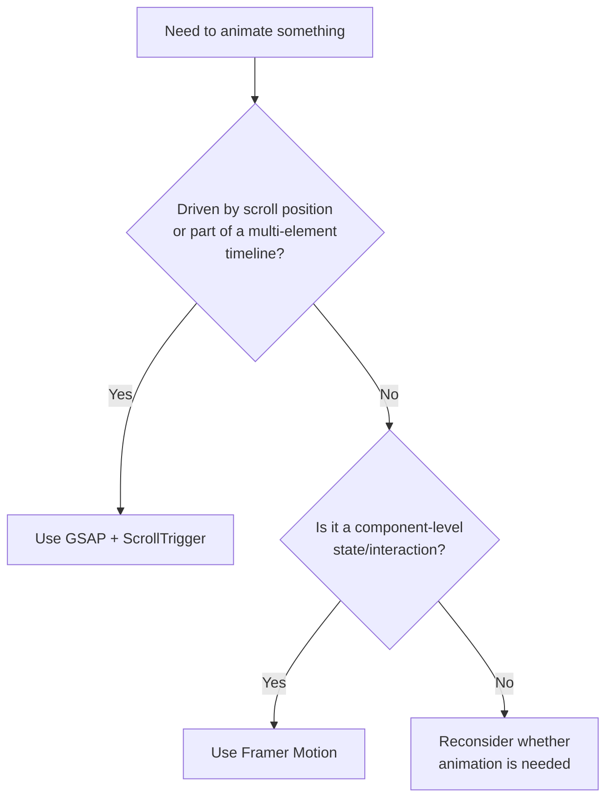

# MOTION_GUIDELINES.md — Animation Standards

Motion rules for this project. Every animation must pass through this document's philosophy before it ships — see the [Non-Negotiable Rules](../CLAUDE.md#non-negotiable-rules) in CLAUDE.md.

---

## Table of Contents

1. [Motion Philosophy](#motion-philosophy)
2. [Hero Story](#hero-story)
3. [GSAP Usage](#gsap-usage)
4. [Framer Motion Usage](#framer-motion-usage)
5. [Scroll Storytelling](#scroll-storytelling)
6. [Micro Interactions](#micro-interactions)
7. [Animation Timing](#animation-timing)
8. [Performance Rules](#performance-rules)
9. [Animation Checklist](#animation-checklist)
10. [Related Documentation](#related-documentation)

---

## Motion Philosophy

Motion must **clarify**, never decorate. Before adding any animation, ask: *does this help the visitor understand hierarchy, sequence, or cause-and-effect faster than a static state would?* If the answer is no, don't add it.

- Premium restraint over spectacle — see brand personality in [CLAUDE.md](../CLAUDE.md#business-objective).
- Motion should feel inevitable, not performed. If a user notices the animation before the content, it's too much.
- Every animated element must also have a correct, complete static state (see [Performance Rules](#performance-rules) on `prefers-reduced-motion`).

---

## Hero Story

The hero is the one place a slightly more deliberate sequence is earned — it sets the tone for the entire brand experience.

| Beat | Element | Timing |
|---|---|---|
| 1 | Background/visual settles in | 0–400ms |
| 2 | Headline reveals (mask or fade-up) | 200–700ms |
| 3 | Subheadline reveals | 400–850ms |
| 4 | Primary CTA reveals | 600–1000ms |
| 5 | Scroll cue (subtle) fades in | 1000–1200ms |

Total sequence should resolve in **under 1.2 seconds** — a slow hero costs trust with a B2B buyer who is evaluating operational competence.

---

## GSAP Usage

Use GSAP (with ScrollTrigger) for anything that is **sequenced against scroll position**:

- Scroll-linked reveals across multiple sections
- Pinning a section while internal content progresses
- Timeline sequences with multiple coordinated elements (e.g., hero beat sequence above)
- Parallax (used sparingly — see [Scroll Storytelling](#scroll-storytelling))

### Rules

1. Initialize GSAP animations inside `useEffect` / `useGSAP` (from `@gsap/react`), scoped to a ref — never global selectors.
2. Always `.revert()` or kill ScrollTriggers on unmount to avoid leaks across client-side navigation.
3. Register plugins (`ScrollTrigger`) once, not per-component.
4. Never fight React's render cycle — GSAP should animate refs, not drive state.

```tsx
useGSAP(() => {
  gsap.from(headlineRef.current, { y: 24, opacity: 0, duration: 0.6, ease: "power2.out" });
}, { scope: containerRef });
```

---

## Framer Motion Usage

Use Framer Motion for **component-level UI state and interaction**:

- Hover / tap / focus states on buttons and cards
- Enter/exit transitions (accordions, modals, mobile nav overlay)
- Layout animations (`layout` prop) for reflowing UI
- Page/section fade-ins that aren't scroll-sequenced

### Decision Rule



Do not use both libraries on the same element — pick one per element to avoid conflicting transform ownership.

---

## Scroll Storytelling

- Reveals should be staggered in small groups (3–5 items max), not the entire page at once.
- Parallax is a seasoning, not a base ingredient — max one parallax layer per section, subtle offset only (10–20% scroll differential).
- Pinning is reserved for sections that genuinely tell a sequential story (e.g., a process/how-it-works section) — not applied by default to every section.
- Never let scroll-triggered animation delay the visitor's ability to reach content on fast scroll or via anchor links.

---

## Micro Interactions

| Element | Interaction | Spec |
|---|---|---|
| Primary button | Hover | Scale 1.0 → 1.02, 150ms ease-out |
| Primary button | Active/press | Scale → 0.98, 100ms |
| Card | Hover | `shadow-sm` → `shadow-md`, 200ms |
| Input | Focus | Border color transition, 150ms |
| Nav link | Hover | Underline grows from left, 200ms |
| Form submit | Loading | Spinner replaces label, button disabled |

---

## Animation Timing

| Token | Duration | Use |
|---|---|---|
| `motion-instant` | 100ms | Press/tap feedback |
| `motion-fast` | 150–200ms | Hover states, small UI transitions |
| `motion-base` | 300ms | Default component transitions |
| `motion-slow` | 500ms | Section reveals |
| `motion-story` | 600–1000ms | Hero sequence, scroll storytelling beats |

Standard easing: `power2.out` (GSAP) / `[0.16, 1, 0.3, 1]` (Framer Motion) for entrances; `power1.inOut` / `easeInOut` for continuous or looping motion.

---

## Performance Rules

1. Animate only `transform` and `opacity` — never `top`/`left`/`width`/`height` or layout-triggering properties.
2. Always respect `prefers-reduced-motion`: reduce to opacity-only crossfades, remove parallax and pinning entirely.
3. Kill/cleanup all GSAP ScrollTriggers and Framer Motion listeners on unmount.
4. Avoid `will-change` as a blanket fix — apply only to elements actively animating, remove after.
5. Cap concurrent animated elements in view — see [PERFORMANCE.md](PERFORMANCE.md#animation-budget) for the enforced budget.
6. Test on a throttled CPU (4x slowdown) before considering an animation done.

---

## Animation Checklist

- [ ] Does this animation clarify something, or just decorate?
- [ ] Does it resolve in a timing token, not an arbitrary value?
- [ ] Is it built with the correct library per the [decision rule](#framer-motion-usage)?
- [ ] Does it degrade correctly under `prefers-reduced-motion`?
- [ ] Are only `transform`/`opacity` animated?
- [ ] Is cleanup (ScrollTrigger kill / effect cleanup) in place?
- [ ] Does it still perform acceptably on a throttled CPU?

### Anti-patterns

| Anti-pattern | Why it's rejected |
|---|---|
| Animating every section identically on scroll | Predictable motion reads as templated, not premium |
| GSAP and Framer Motion both targeting the same element | Transform conflicts, unpredictable results |
| Parallax on more than one layer per section | Visual noise, performance cost |
| No reduced-motion fallback | Accessibility failure, see [ACCESSIBILITY.md](ACCESSIBILITY.md) |
| Animation blocking interaction (can't click until animation finishes) | Frustrates high-intent B2B visitors |

---

## Related Documentation

- [CLAUDE.md](../CLAUDE.md) — non-negotiable rule that motion must improve understanding
- [DESIGN_SYSTEM.md](DESIGN_SYSTEM.md) — the components these animations apply to
- [UX_GUIDELINES.md](UX_GUIDELINES.md) — interaction guidelines these animations implement
- [PERFORMANCE.md](PERFORMANCE.md) — enforced animation performance budget
- [TECH_ARCHITECTURE.md](TECH_ARCHITECTURE.md) — where animation logic lives in the codebase
