# PROJECT.md — Project Overview

High-level orientation for anyone joining this project. For the reasoning behind these decisions, see [CLAUDE.md](../CLAUDE.md). For deep client and market detail, see [BUSINESS_CONTEXT.md](BUSINESS_CONTEXT.md).

---

## Table of Contents

1. [Business Summary](#business-summary)
2. [Project Goals](#project-goals)
3. [Target Audience](#target-audience)
4. [Success Metrics](#success-metrics)
5. [Project Timeline](#project-timeline)
6. [Deliverables](#deliverables)
7. [Project Scope](#project-scope)
8. [Future Scope](#future-scope)
9. [Related Documentation](#related-documentation)

---

## Business Summary

SK Internationals is a B2B logistics company. This project is a premium, single-brand marketing website whose job is to convert business visitors (freight forwarders, importers/exporters, procurement teams) into qualified quote requests.

Full company background, services, and market positioning live in [BUSINESS_CONTEXT.md](BUSINESS_CONTEXT.md) — this file only summarizes what's needed to make project-level decisions.

---

## Project Goals

| Goal | Description |
|---|---|
| Build trust fast | Communicate credibility within 10 seconds of landing |
| Generate qualified leads | Every path on the site should plausibly end at a quote request |
| Elevate brand perception | The site itself should read as evidence of operational excellence |
| Establish a durable design system | Future pages/campaigns extend the system rather than reinvent it |
| Ship a technically excellent asset | Fast, accessible, SEO-sound — see [PERFORMANCE.md](PERFORMANCE.md), [ACCESSIBILITY.md](ACCESSIBILITY.md), [SEO.md](SEO.md) |

Non-goals for this phase: e-commerce, customer self-service, multi-tenant portals (see [Future Scope](#future-scope)).

---

## Target Audience

Primary: B2B decision-makers evaluating a logistics partner — procurement managers, supply chain directors, operations leads at importing/exporting businesses.

Full personas, pain points, and journey mapping live in [BUSINESS_CONTEXT.md](BUSINESS_CONTEXT.md#target-audience) and [UX_GUIDELINES.md](UX_GUIDELINES.md#user-flow).

---

## Success Metrics

### Quantitative

| Metric | Target |
|---|---|
| Lighthouse Performance | ≥ 95 |
| Lighthouse Accessibility | ≥ 95 |
| Lighthouse SEO | ≥ 95 |
| Largest Contentful Paint | < 2.5s |
| Quote-form conversion rate | Baseline established at launch, improved iteratively |
| Bounce rate on hero | Below industry logistics benchmark |

### Qualitative

- [ ] A visitor unfamiliar with the company can state what SK Internationals does after 10 seconds
- [ ] The site is indistinguishable from a well-funded, purpose-built agency build — not a template
- [ ] Internal stakeholders would confidently share the link with a prospective enterprise client

---

## Project Timeline

Timeline is phase-based. Durations are planning estimates and should be replaced with committed dates once scheduling is confirmed with the client.

```mermaid
gantt
    title Delivery Phases (relative)
    dateFormat  X
    axisFormat %s

    section Discovery
    Business & audience research      :a1, 0, 5d
    Content & sitemap definition      :a2, after a1, 3d

    section Design
    Design system                     :b1, after a2, 5d
    High-fidelity screens              :b2, after b1, 5d

    section Build
    Core architecture & sections       :c1, after b2, 8d
    Motion & interaction pass          :c2, after c1, 4d

    section Quality
    Performance & accessibility pass   :d1, after c2, 3d
    SEO & content QA                   :d2, after d1, 2d

    section Launch
    Deployment & monitoring            :e1, after d2, 2d
```

| Phase | Maps to workflow phase in CLAUDE.md |
|---|---|
| Discovery | Understand |
| Design | Plan, Design |
| Build | Build |
| Quality | Review, Optimize |
| Launch | Review Again |

---

## Deliverables

- [ ] Fully responsive Next.js (App Router) marketing website
- [ ] Complete section set: Hero, About/Credibility, Services, Process, Industries Served, Trust/Social Proof, Contact & Quote Request, Footer
- [ ] Design system implemented as reusable, tokenized components (see [DESIGN_SYSTEM.md](DESIGN_SYSTEM.md))
- [ ] Quote/contact form with validation (React Hook Form + Zod)
- [ ] Scroll storytelling and micro-interactions (see [MOTION_GUIDELINES.md](MOTION_GUIDELINES.md))
- [ ] SEO implementation: metadata, sitemap, robots, structured data (see [SEO.md](SEO.md))
- [ ] Accessibility pass to WCAG AA (see [ACCESSIBILITY.md](ACCESSIBILITY.md))
- [ ] Production deployment on Vercel
- [ ] This documentation system, kept current

---

## Project Scope

### In Scope

- Single premium marketing/landing site (multi-section, single primary page plus supporting routes as needed, e.g. legal pages)
- Lead-generation contact/quote flow
- Full design system and motion system
- SEO and performance optimization
- Deployment and launch on Vercel

### Out of Scope (this phase)

See [Future Scope](#future-scope) — anything requiring authentication, persistent user data, or content-management workflows is explicitly deferred.

---

## Future Scope

Documented so future decisions don't accidentally foreclose these paths, not committed work.

| Candidate | Notes |
|---|---|
| CMS integration | Editorial control for services/industries content without a redeploy |
| Multi-language support | If SK Internationals expands into non-English-speaking markets |
| Client portal | Shipment tracking / account access — would require auth and a data layer, a materially different architecture than [TECH_ARCHITECTURE.md](TECH_ARCHITECTURE.md) currently describes |
| Insights/blog section | SEO content marketing play, see [SEO.md](SEO.md) keyword strategy |
| Careers page | If hiring becomes a stated business goal |

---

## Related Documentation

- [CLAUDE.md](../CLAUDE.md) — governing philosophy and non-negotiable rules
- [BUSINESS_CONTEXT.md](BUSINESS_CONTEXT.md) — full client and market context
- [DESIGN_SYSTEM.md](DESIGN_SYSTEM.md) — visual language backing these deliverables
- [TECH_ARCHITECTURE.md](TECH_ARCHITECTURE.md) — technical blueprint for the build phase
