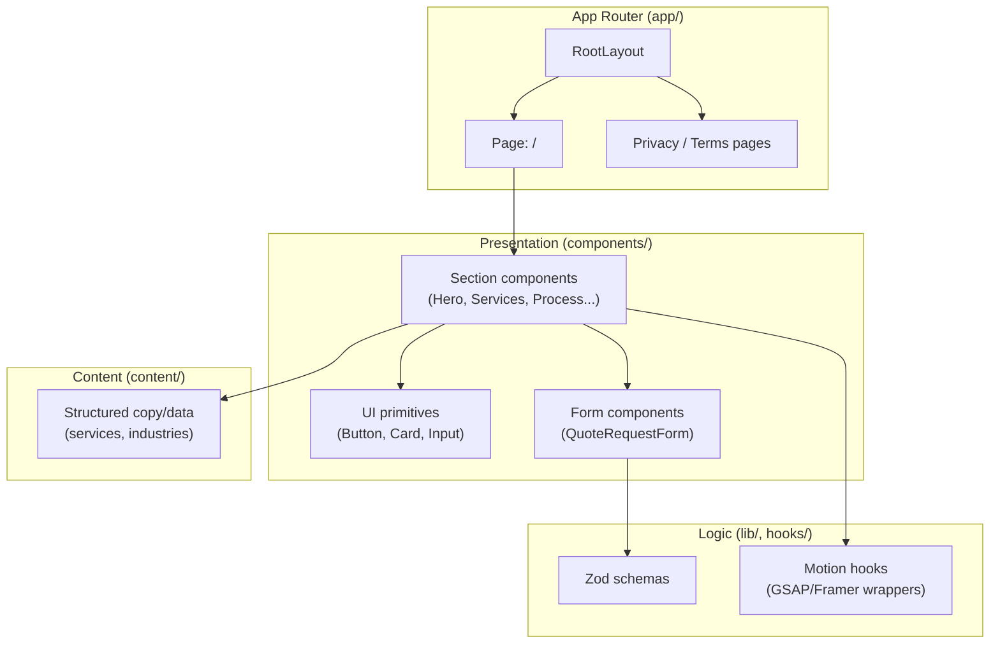
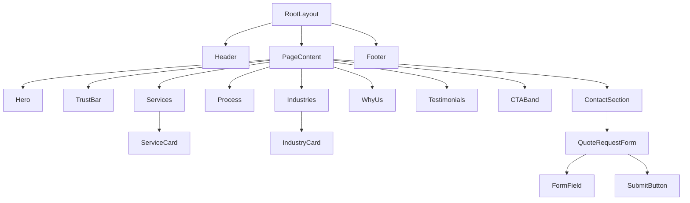
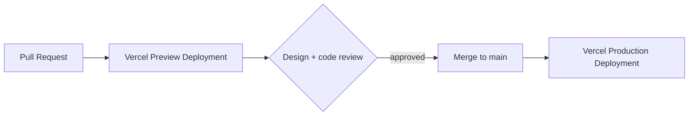

# TECH_ARCHITECTURE.md — Technical Blueprint

The system-level shape of the application. [CODING_STANDARDS.md](CODING_STANDARDS.md) governs how individual files are written; this file governs how they fit together.

---

## Table of Contents

1. [Application Architecture](#application-architecture)
2. [Rendering Strategy](#rendering-strategy)
3. [Component Hierarchy](#component-hierarchy)
4. [State Management](#state-management)
5. [Dependency Justification](#dependency-justification)
6. [Folder Structure](#folder-structure)
7. [Animation Architecture](#animation-architecture)
8. [Deployment Strategy](#deployment-strategy)
9. [Future Scalability](#future-scalability)
10. [Related Documentation](#related-documentation)

---

## Application Architecture

A statically-generated, content-driven marketing site — not an application in the CRUD sense. There is no database and no authenticated user in this phase (see [PROJECT.md](PROJECT.md#project-scope)).

---

## Rendering Strategy

- **Static by default.** Every route is statically generated at build time — there's no per-request data dependency in this phase.
- **Server Components by default.** Client Components are opt-in, scoped to the smallest subtree that needs interactivity (form inputs, animated elements, mobile nav) — see [CODING_STANDARDS.md](CODING_STANDARDS.md#component-rules).
- **No ISR/SSR needed yet.** Once a CMS is introduced (see [Future Scalability](#future-scalability)), revisit with Incremental Static Regeneration.
- Metadata generated via the Next.js Metadata API at build time — see [SEO.md](SEO.md).

---

## Component Hierarchy

Section order and rationale are defined in [UX_GUIDELINES.md](UX_GUIDELINES.md#section-hierarchy) — this diagram reflects structure, not content decisions.

---

## State Management

No global state library (Redux, Zustand, Jotai) is justified for this project's scope — there is no cross-page shared state, no authenticated session, no server-synced client cache.

| State type | Where it lives |
|---|---|
| Form state | React Hook Form, local to `QuoteRequestForm` |
| Mobile nav open/closed | `useState`, local to `Header` |
| Scroll/animation progress | GSAP/Framer Motion internal state, not React state |
| Validation state | Derived from Zod via React Hook Form resolver |

If the [client portal](PROJECT.md#future-scope) is ever built, that is the trigger to reconsider this decision — not before.

---

## Dependency Justification

Every dependency in `package.json` must earn its place. Current and planned dependencies:

| Dependency | Justification | Alternative considered |
|---|---|---|
| Next.js | App Router, static generation, Metadata API, Vercel-native | Vite + React Router — loses built-in SSG/SEO tooling |
| React 19 | Required by Next.js 16 | — |
| TypeScript | Non-negotiable per [CLAUDE.md](../CLAUDE.md#coding-philosophy) | — |
| Tailwind CSS v4 | Token-driven styling matching [DESIGN_SYSTEM.md](DESIGN_SYSTEM.md), no runtime CSS-in-JS cost | CSS Modules — more boilerplate for a token system this size |
| GSAP + `@gsap/react` | Only library with production-grade ScrollTrigger for scroll storytelling | Framer Motion `useScroll` — insufficient for complex pinned/sequenced timelines |
| Framer Motion | Best-in-class for component-level React animation/gesture state | React Spring — smaller ecosystem, less Next.js-specific guidance |
| Lenis | Smooth scroll that stays compatible with GSAP ScrollTrigger | Native `scroll-behavior: smooth` — insufficient control for scroll storytelling |
| React Hook Form | Minimal re-renders, first-class Zod integration | Formik — heavier, more re-renders |
| Zod | Runtime validation + inferred types from one schema | Yup — weaker TypeScript inference |
| Lucide React | Tree-shakeable, consistent stroke-based icon set matching [DESIGN_SYSTEM.md](DESIGN_SYSTEM.md#icons) | Heroicons — smaller icon set for a B2B/industrial context |

Before adding any new dependency, add a row here first.

---

## Folder Structure

Canonical structure is defined once in [CODING_STANDARDS.md](CODING_STANDARDS.md#folder-structure) — this file doesn't repeat it. The architectural principle: **routes are thin, sections compose UI primitives, logic lives in `lib/`/`hooks/`, content is data, not markup.**

---

## Animation Architecture

| Concern | Location |
|---|---|
| Lenis smooth-scroll provider | Wraps the app once in `app/layout.tsx` (or a `Providers` client component) |
| GSAP plugin registration (`ScrollTrigger`) | Registered once in a shared setup module, not per-component |
| GSAP timelines | Encapsulated in section-scoped hooks (`useHeroTimeline`, etc.) — see [CODING_STANDARDS.md](CODING_STANDARDS.md#hooks) |
| Framer Motion variants | Co-located with the component, or shared in `lib/motion-variants.ts` if reused across 3+ components |

Rules for what animates with which library are defined in [MOTION_GUIDELINES.md](MOTION_GUIDELINES.md#gsap-usage) — this section only governs *where the code lives*.

---

## Deployment Strategy

- **Host:** Vercel, connected directly to the git repository.
- **Production branch:** deploys on merge to `main`.
- **Preview deployments:** automatic for every pull request — used for design/stakeholder review before merge.
- **Environment variables:** managed in Vercel project settings, never committed; `.env.local` for local development only (already covered by `.gitignore`).
- **Build checks:** lint (`npm run lint`) and build (`npm run build`) must pass before merge.

---

## Future Scalability

| Future need | Architectural implication |
|---|---|
| CMS integration | Introduce a data-fetching layer (e.g., Next.js `fetch` with ISR) — content model replaces static `content/` files |
| Multi-language | Adopt `next-intl` or App Router i18n routing; content structure needs locale keys |
| Client portal | Requires auth, a database, and re-evaluating [State Management](#state-management) — likely a separate authenticated sub-app |
| Blog/insights | New route segment under `app/insights/`, likely paired with CMS integration above |

None of these are committed work — see [PROJECT.md](PROJECT.md#future-scope). Listed here so today's architecture doesn't accidentally block them.

---

## Related Documentation

- [CODING_STANDARDS.md](CODING_STANDARDS.md) — file-level conventions within this architecture
- [MOTION_GUIDELINES.md](MOTION_GUIDELINES.md) — animation rules implemented by the architecture above
- [PERFORMANCE.md](PERFORMANCE.md) — budgets this architecture must stay within
- [PROJECT.md](PROJECT.md) — scope and future-scope driving these decisions
