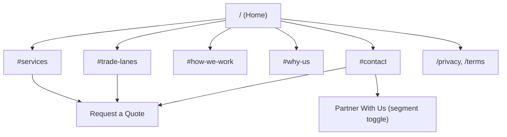
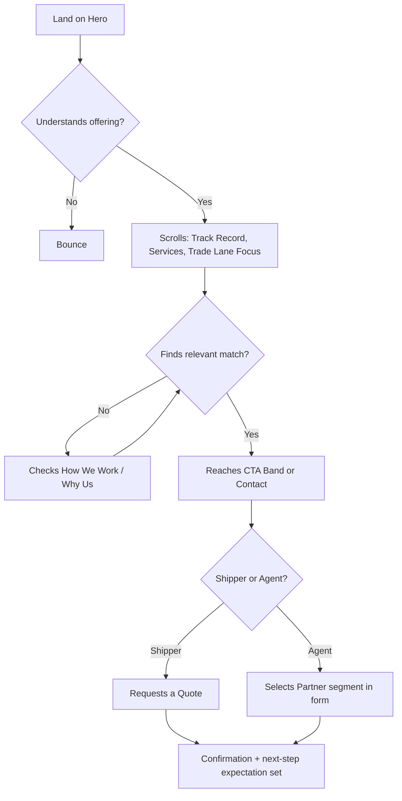

# UX_GUIDELINES.md — User Experience Standards

How the site is structured, navigated, and converted through. [DESIGN_SYSTEM.md](DESIGN_SYSTEM.md) defines what components look like; this file defines how they're arranged and behave. Section structure below reflects the approved Homepage UX Architecture, produced after the [strategic positioning analysis](BUSINESS_CONTEXT.md#strategic-positioning-decisions).

---

## Table of Contents

1. [Navigation](#navigation)
2. [Section Hierarchy](#section-hierarchy)
3. [Information Architecture](#information-architecture)
4. [Conversion Strategy](#conversion-strategy)
5. [CTA Rules](#cta-rules)
6. [Layout Principles](#layout-principles)
7. [Responsive Behaviour](#responsive-behaviour)
8. [User Flow](#user-flow)
9. [Accessibility Rules](#accessibility-rules)
10. [Interaction Guidelines](#interaction-guidelines)
11. [Related Documentation](#related-documentation)

---

## Navigation

- Sticky header, transparent-to-solid transition on scroll (see [MOTION_GUIDELINES.md](MOTION_GUIDELINES.md#micro-interactions)).
- Primary nav limited to 5 items maximum — Services, Trade Lanes, How We Work, Why Us, Contact.
- "Request a Quote" is always visually distinct from nav links — it's a button, not a link, and never collapses into the hamburger menu on mobile.
- The overseas-partner/agent path ("Partner With Us") is **not** a separate nav item — it surfaces as a subordinate text link near the primary CTA (hero, CTA band) and resolves as a segment toggle inside the quote form. Keeping it out of primary nav preserves a single, obvious IA for the majority direct-shipper audience while still serving the agent segment at the point of conversion — see [CTA Rules](#cta-rules).
- Mobile navigation: full-screen overlay, not a cramped dropdown — respects the premium positioning in [BUSINESS_CONTEXT.md](BUSINESS_CONTEXT.md#brand-positioning).

---

## Section Hierarchy

Finalized homepage section order and the job each does in the funnel — challenged and revised from the original draft during the strategic analysis (see [BUSINESS_CONTEXT.md](BUSINESS_CONTEXT.md#strategic-positioning-decisions)):

| Order | Section | Job |
|---|---|---|
| 1 | Hero | State who/what/why in <10s, first 5s reads as "composed trust" — see [CLAUDE.md](../CLAUDE.md#mission) |
| 2 | Track Record Bar | Credibility via tenure (est. 2011) and lane/service breadth — not badges we don't have yet |
| 3 | Services Overview | Let the visitor self-identify their need; absorbs lightweight industry tags (no standalone "Industries Served" — no confirmed industry-specific proof points exist) |
| 4 | Trade Lane Focus | Make the Gulf/Red Sea/Indian Sub-Continent specialism un-ignorable — the #1 differentiator, previously missing from the hierarchy entirely |
| 5 | How We Work | Counter the "will this be a black box" objection with real process steps |
| 6 | Why SK Internationals | Differentiate vs. broker and vs. big 3PL |
| 7 | Proof & Commitment | Reserved, honest trust slot — value-pillar content at launch, swaps to real testimonials later; never faked |
| 8 | CTA Band | Dedicated, unmissable conversion moment |
| 9 | Contact / Quote | Low-friction conversion, with the shipper/agent segment toggle |
| 10 | Footer | Secondary navigation, compliance links, general contact |

No section may be skipped or reordered without checking it still answers the "one business question" rule from [DESIGN_SYSTEM.md](DESIGN_SYSTEM.md#design-principles).

---

## Information Architecture

Single-page architecture for launch (see [PROJECT.md](PROJECT.md#project-scope)) with anchor-based sections. Supporting routes (privacy/terms) are the only separate pages. Future expansion (insights/blog, per-service pages) is tracked in [PROJECT.md](PROJECT.md#future-scope).

---

## Conversion Strategy

Every section maps to a stage in the [Customer Journey](BUSINESS_CONTEXT.md#customer-journey):

| Journey Stage | Sections responsible |
|---|---|
| Awareness | Hero, Track Record Bar |
| Evaluation | Services Overview, Trade Lane Focus, How We Work, Why SK Internationals |
| Decision | Proof & Commitment, CTA Band, Contact/Quote |

Named conversion mechanisms:

- **Trade-lane-aware quote path** — a lane selector inside the quote form (Gulf / Red Sea / Indian Sub-Continent) lowers friction and signals expertise simultaneously.
- **Response-time microcopy** — "We respond within one business day" placed near every CTA, directly defusing the biggest B2B lead-gen anxiety (submitting into a void).
- **Segment toggle** — resolves the shipper-vs-agent audience split at the point of conversion rather than fragmenting the page.

No section exists purely for decoration — if a section doesn't move the visitor toward one of these stages, cut it.

---

## CTA Rules

1. Exactly one primary CTA visible per viewport ("Request a Quote").
2. CTA copy is a specific verb phrase, never generic — "Request a Quote," not "Submit" or "Click Here."
3. **Two-tier CTA structure:**
   - Primary: "Request a Quote" — button, present in Header, Hero, CTA Band, Contact.
   - Secondary: "Partner With Us" — a subordinate text link (never a competing button) near the primary CTA in Hero and CTA Band, resolving into a segment toggle at the top of the Contact form.
4. Primary CTA repeats at header, hero, CTA band, contact section, footer — but only one `accent`-styled button is visible on screen at any scroll position.
5. Never place two competing CTAs of equal visual weight in the same view — this is why the agent path is a text link, not a second button.

---

## Layout Principles

- Respect the grid defined in [DESIGN_SYSTEM.md](DESIGN_SYSTEM.md#grid) — no ad hoc containers.
- Break strict symmetry deliberately in feature sections (image/text offset) to avoid the "template" feel called out in [CLAUDE.md](../CLAUDE.md#anti-patterns).
- Maintain consistent vertical rhythm between sections using the spacing scale.
- Text line length capped around 65–75 characters for body copy blocks.

---

## Responsive Behaviour

- Mobile-first: design and build the 375px viewport first, then expand.
- Touch targets minimum 44×44px on all interactive elements.
- No hover-only interactions — every hover state must have a functional mobile equivalent (tap, always-visible).
- Breakpoints follow [DESIGN_SYSTEM.md](DESIGN_SYSTEM.md#grid).
- Complex desktop layouts (e.g., offset image/text, the Trade Lane Focus map) simplify to single-column stacks on mobile — never shrink them proportionally.

---

## User Flow

Design and copy decisions should be evaluated against where they sit in this flow — see [CONTENT_STRATEGY.md](CONTENT_STRATEGY.md) for how copy supports each step.

---

## Accessibility Rules

UX-level rules only — full technical implementation lives in [ACCESSIBILITY.md](ACCESSIBILITY.md).

- Logical tab order must match visual order.
- A visible "Skip to content" link precedes the header.
- No content or functionality conveyed by hover alone.
- Focus is never trapped outside of intentional modal/overlay states.
- Respect `prefers-reduced-motion` at the UX level — see [MOTION_GUIDELINES.md](MOTION_GUIDELINES.md#performance-rules).

---

## Interaction Guidelines

| Interaction | Rule |
|---|---|
| Hover | Subtle, fast (~150ms), never the only feedback signal |
| Focus | Always visible, never suppressed |
| Click/Tap | Immediate visual feedback within one frame |
| Form submission | Button enters a loading state, disabled during submit, clear success/error result |
| Scroll-triggered reveals | Content should never fully hide critical information from non-JS or slow-scroll users |

### Anti-patterns

| Anti-pattern | Why it's rejected |
|---|---|
| Nav item count > 5 | Overwhelms a decision-focused B2B visitor |
| Two primary-styled CTAs in one view | Splits attention, weakens conversion signal |
| A dedicated "Partner With Us" page/path duplicating the whole IA | Doubles maintenance and dilutes the single primary CTA rule for no real benefit — resolve at the form instead |
| Hover-only reveal of key info | Breaks on touch devices |
| Auto-playing carousels for testimonials | Reduces read completion, accessibility issue |

---

## Related Documentation

- [DESIGN_SYSTEM.md](DESIGN_SYSTEM.md) — visual tokens behind these layouts
- [MOTION_GUIDELINES.md](MOTION_GUIDELINES.md) — how these interactions animate
- [ACCESSIBILITY.md](ACCESSIBILITY.md) — full technical accessibility spec
- [CONTENT_STRATEGY.md](CONTENT_STRATEGY.md) — copy supporting this flow
- [BUSINESS_CONTEXT.md](BUSINESS_CONTEXT.md) — the journey and segmentation this structure is built around
